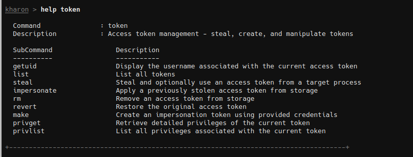
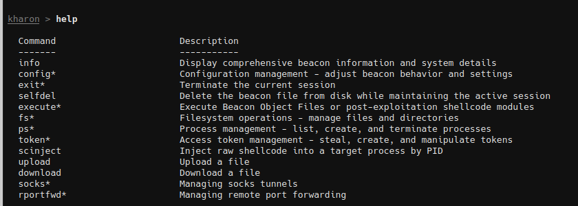
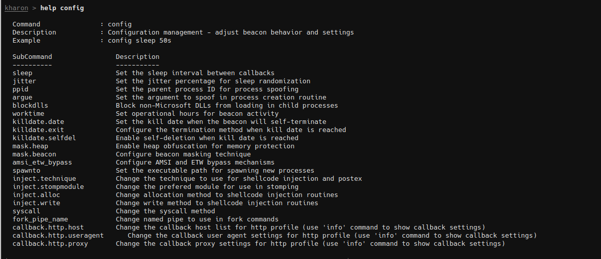
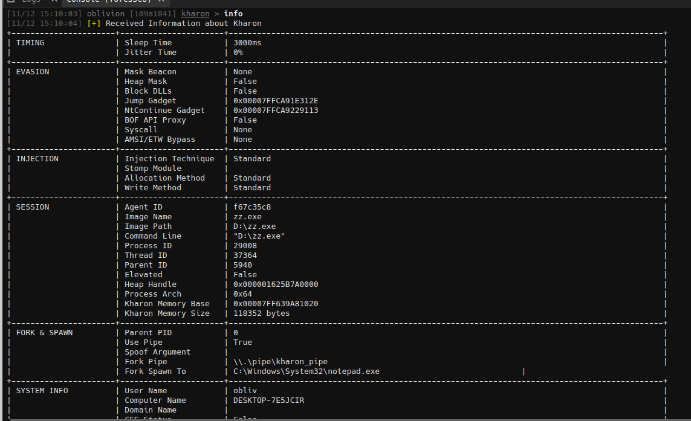
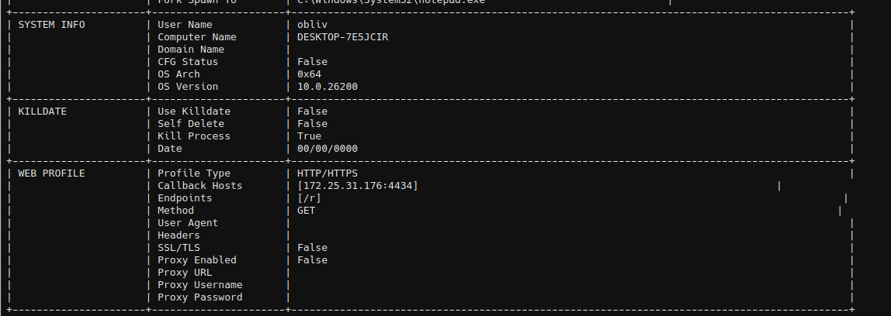

# Kharon v0.2

**Kharon** is a fully **Position-Independent Code (PIC)** agent that operates without a reflective loader. It incorporates multiple evasion mechanisms, including **sleep obfuscation**, **heap obfuscation during sleep**, **stack spoofing with indirect syscalls**, a **BOF API proxy** for spoofed and indirect BOF API execution, and **AMSI/ETW bypass**.

For detailed information about features, setup, and usage, check the official documentation:  
https://doc.kharon-agent.xyz

## PIC Logic

Kharon uses a class-based design to store the beacon instance.  
The instance is retrieved using a **magic value** stored in a custom heap, allowing reliable access without relying on global symbols.

## Core Features

This section covers the main capabilities related to evasion, malleable profiles, and runtime control.

### HTTP Malleable Profile

- Proxy configuration (URL, username, and password)
- Domain rotation strategies:
  - Random
  - Failover
  - Round-robin
- Multi-host configuration
- Independent User-Agent and headers for GET and POST requests
- Custom parameters
- Fine-grained control over route behavior:
  - Output data via body, parameter, or header
  - Append / Prepend output data
- Custom empty server responses
- Custom error responses

Documentation here: https://doc.kharon-agent.xyz/getting-started/http-listener

### Post-Exploitation Execution

Post-exploitation routines are based on **Beacon Object Files (BOFs)** and **PIC shellcode**, which can be executed:
- In the current process
- In a remote target process

### Evasion

1. **Spoofed + Indirect Syscalls**  
   Applies call stack spoofing to selected API executions.  
   Supported APIs are listed here:  
   https://doc.kharon-agent.xyz/beacon-object-file-bof

2. **BOF API Proxy**  
   Proxies BOF API calls to enable spoofed call stacks and indirect syscalls.

3. **Memory Evasion**  
   - Sleep obfuscation
   - Heap masking during beacon sleep

### Token Manipulation

Provides full token management capabilities using the `token` command:
- Token stealing and storage
- Listing stored tokens
- Token impersonation
- Additional token-related operations

Example:  

## Base Commands
- info
- config*
- exit
   - process
   - thread
- selfdel
- execute
   - postex
   - bof
- fs
   - ls
   - pwd
   - cat
   - mkdir
   - mv
   - cp
   - cd
- ps
   - run
   - pwsh
   - kill
   - list
- token
   - getuid
   - list
   - steal
   - impersonate
   - rm
   - revert
   - make
   - privget
   - privlist
- scinject
- upload
- download
- socks
   - start
   - stop
- rportfwd
   - start
   - stop

### Runtime Configuration Changes

Kharon supports live runtime configuration updates using the `config` command.  
This allows dynamic changes to beacon behavior, including:

- Kill date (date-based or self-delete)
- Working hours
- HTTP callback configuration (host, port, User-Agent)
- BOF API proxy enable/disable
- Spoofed + indirect syscall enable/disable
- Memory obfuscation:
  - Heap masking status
  - Beacon masking technique
- Injection behavior:
  - Allocation method
  - Write technique
  - Injection strategy
- Process creation behavior:
  - Parent Process ID (PPID) spoofing
  - Block DLL policy
- AMSI / ETW bypass
- Sleep and jitter configuration

Example:  

---

### Beacon Configuration Inspection

Retrieve the current beacon configuration using the `info` command:

  

