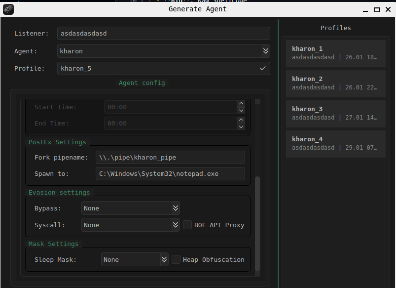
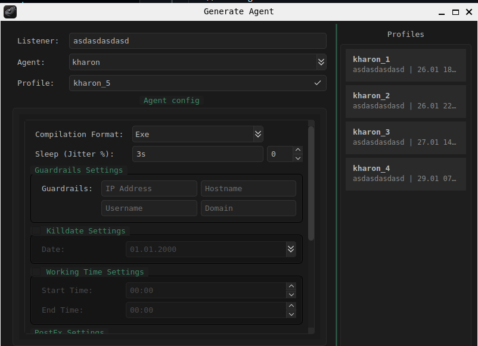

# Build
The image bellow is a GUI for build agent

## Compilation Format
- **Exe**: Puts the shellcode in the.text and calls it via pointer
- **Dll**: Puts the shellcode in .text calls it via pointer, to execute it needs to call the exported function called Runner
- **Svc**: Service binary that puts shellcode in .text calls it via pointer
- **Bin**: Raw Shellcode

## Sleep / Jitter 
Sleep time for Agent Callback and Jitter in percentage for randomization

## Guardrails
Execution control, IpAddress, Hostname, Username and Domain can be used. The beacon will only run if it is in an environment with these settings

## Killdate
Setting a date to stop execution, allowing you to change the exit method (process/thread) and self-deletion.

## Worktime
Time range in which the beacon can perform a callback.

## Fork Named Pipe 
Name of the pipe used for fork&run routines.

## Spawn to
Sacrificial process used to execute fork&run routines.

## Bypass
AMSI/ETW bypass configuration for dotnet routines using the post-ex arsenal dotnet command.

## Syscall and BOF API Proxy
Configuration to choose whether specific APIs will be Spoof+Indirect, and BOF API Proxy will use these functions by proxying BOF functions to Spoof+Indirect.

##  Sleep Mask + Heap Obf
The technique used for beacon obfuscation in memory, Heap Obf, is for obfuscating heap allocations made by the beacon during sleep.